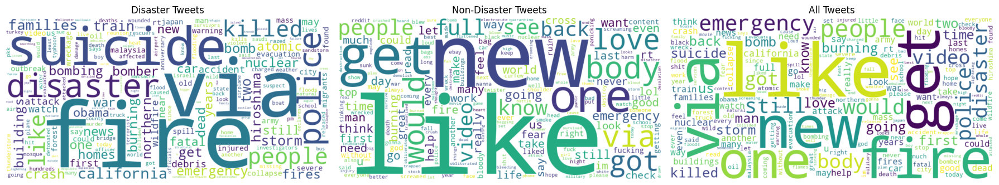

# 🚨 Natural Language Processing with Disaster Tweets

<div align="center">


**Learning NLP through PyTorch: Classify disaster tweets from scratch**

[🎯 Overview](#-project-overview) • [📊 Competition](#-kaggle-competition) • [🚀 Quick-Start](#-quick-start) • [📚 Learning Path](#-learning-path)

</div>

> **Learning Philosophy**: No copy-paste code allowed! Build fundamental understanding through hands-on implementation, then enhance with modern tools.

---

## 👨‍💻 Author
<div align="center">

**Francisco Teixeira Barbosa**

[](https://github.com/Tuminha)
[](https://www.kaggle.com/franciscotbarbosa)
[](mailto:cisco@periospot.com)
[](https://twitter.com/cisco_research)

*Learning Machine Learning through hands-on projects • Building NLP expertise step by step*

</div>

---

## 🎯 Project Overview

**What**: Build a text classification model to identify whether tweets are about real disasters or not using PyTorch from scratch.

**Why**: Master fundamental NLP concepts through hands-on implementation before leveraging modern transformer libraries.

**Expected Outcome**: A working disaster tweet classifier with strong baseline performance, plus deep understanding of text processing, embeddings, and neural network architectures.

### 🎓 Learning Objectives
- Master text preprocessing and tokenization fundamentals
- Build custom PyTorch models for NLP tasks
- Understand word embeddings and sequence modeling
- Learn proper train/validation/test splits for NLP
- Implement data loaders and training loops
- Evaluate model performance with appropriate metrics
- Progress from raw PyTorch to HuggingFace transformers

### 🏆 Key Achievements
- [ ] Complete data exploration and EDA
- [ ] Implement text preprocessing pipeline
- [ ] Build vocabulary and custom data loaders
- [ ] Create PyTorch baseline model
- [ ] Train and evaluate model properly
- [ ] Generate Kaggle submission
- [ ] Enhance with HuggingFace transformers

---

## 📊 Kaggle Competition

**Source**: [Natural Language Processing with Disaster Tweets](https://www.kaggle.com/competitions/nlp-getting-started)

**Objective**: Predict which tweets are about real disasters (target=1) vs. not (target=0)

**Dataset**: ~7,600 training tweets with disaster labels, ~3,200 test tweets for submission

**Evaluation**: F1-Score (binary classification)

---

## 🚀 Quick Start

### Prerequisites
```bash
pip install torch pandas numpy matplotlib seaborn scikit-learn jupyter
# For Phase 2: transformers datasets tokenizers
```

### Setup
```bash
cd disaster_tweets
jupyter notebook
# Start with 00_exploration.ipynb
```

### Data Setup
1. Download data from Kaggle competition page
2. Place `train.csv` and `test.csv` in `data/raw/`
3. Never modify raw data - all preprocessing goes in `data/interim/`

---

## 📚 Learning Path

### Phase 1: PyTorch Fundamentals 🧠
Build everything from scratch to understand the foundations:

1. **00_exploration.ipynb** - Data exploration and EDA
2. **01_preprocessing.ipynb** - Text cleaning and tokenization
3. **02_vocab_and_dataloader.ipynb** - Vocabulary building and data loading
4. **03_model_baseline.ipynb** - PyTorch model architecture
5. **04_training_and_eval.ipynb** - Training loop and evaluation
6. **05_submission.ipynb** - Kaggle submission generation

### Phase 2: Transformers Enhancement 🚀
Enhance with modern NLP tools:

- HuggingFace transformers integration
- Pre-trained embeddings (BERT, RoBERTa)
- Advanced tokenization strategies
- Transfer learning approaches

---

## 📁 Repository Structure

```
disaster_tweets/
├── README.md                    # This file
├── data/
│   ├── raw/                    # Untouched Kaggle CSVs
│   ├── interim/               # Cleaned/preprocessed data
│   └── processed/             # Features and final tensors
├── notebooks/
│   ├── 00_exploration.ipynb   # Data exploration (TODO-based)
│   ├── 01_preprocessing.ipynb # Text cleaning (TODO-based)
│   ├── 02_vocab_and_dataloader.ipynb # Data pipeline (TODO-based)
│   ├── 03_model_baseline.ipynb # Model architecture (TODO-based)
│   ├── 04_training_and_eval.ipynb # Training loop (TODO-based)
│   ├── 05_submission.ipynb    # Kaggle submission (TODO-based)
│   └── 99_lab_notes.ipynb     # Learning log and insights
├── src/
│   ├── utils/                 # Utility functions (empty)
│   └── models/               # Model definitions (empty)
└── images/                   # Plots and visualizations
```

---

## 🎯 Milestone Progress

### Phase 1: PyTorch Fundamentals
- [x] **Exploration**: Complete EDA and understand data distribution
- [x] **Preprocessing**: Build robust text cleaning pipeline
- [ ] **Data Pipeline**: Create vocabulary and efficient data loaders
- [ ] **Model Architecture**: Design and implement PyTorch classifier
- [ ] **Training**: Implement training loop with proper validation
- [ ] **Evaluation**: Calculate metrics and analyze performance
- [ ] **Submission**: Generate valid Kaggle submission file

### Phase 2: Transformers Enhancement
- [ ] **HuggingFace Integration**: Replace custom components with transformers
- [ ] **Pre-trained Models**: Experiment with BERT/RoBERTa
- [ ] **Advanced Techniques**: Try different tokenization strategies
- [ ] **Performance Optimization**: Fine-tune for better F1-score

---

## 📝 Learning Documentation

**Use `99_lab_notes.ipynb` to document:**
- Key insights from each notebook
- Challenges encountered and solutions
- Performance metrics and improvements
- Ideas for future enhancements
- Questions and research directions

**Philosophy**: Every experiment should be logged. Every mistake is a learning opportunity.

---

## 📊 Key Findings from Exploration & Preprocessing

Based on the comprehensive EDA and preprocessing completed in `00_exploration.ipynb` and `01_preprocessing.ipynb`:

### Dataset Characteristics
- **Size**: 7,613 training tweets
- **Balance**: 43% disaster vs 57% non-disaster (slightly imbalanced)
- **Missing Data**: 61 missing keywords, 2,533 missing locations (33%)

### Text Patterns
- **Average tweet length**: ~100 characters
- **Average word count**: ~15 words per tweet
- **Social media features**: URLs (0.62 avg), hashtags (0.45 avg), mentions (0.36 avg)

### Preprocessing Pipeline Results
- **Domain-aware stopword removal**: Preserved 50 critical disaster-related keywords
- **Comprehensive text cleaning**: URL removal, mention/hashtag handling, emoji conversion
- **Smart text normalization**: Number-to-text conversion, whitespace normalization
- **Feature engineering**: Boolean flags for social media elements (hashtags, mentions, URLs)
- **BERT comparison**: Custom preprocessing produces 4.3x fewer tokens than BERT tokenizer

### Vocabulary Insights
- **Disaster tweets**: High frequency of words like "fire", "suicide", "disaster", "police", "killed"
- **Non-disaster tweets**: More general words like "like", "new", "get", "one", "body"
- **Clear linguistic patterns** distinguish the two classes

### 🛠 Technical Achievements

**Preprocessing Pipeline Excellence:**
- ✅ **Smart Emoji Handling**: Converts emojis to meaningful text (🔥 → "fire")
- ✅ **Domain-Aware Processing**: Preserves disaster keywords while removing noise
- ✅ **Comprehensive Cleaning**: Handles URLs, mentions, hashtags, punctuation
- ✅ **Feature Engineering**: Creates boolean flags for social media elements
- ✅ **BERT Comparison**: Demonstrates 4.3x efficiency advantage over transformer tokenization

**Data Quality Improvements:**
- **Clean datasets** saved to `data/interim/` folder
- **Consistent preprocessing** applied to both train and test sets
- **Validation pipeline** ensures data integrity and column consistency
- **Performance tracking** with word count differences for quality assurance

### 🖼 Visualizations
<div align="center">


<br /><br />


<br /><br />


<br /><br />



</div>

---

## 🛠 Technical Stack

| Component | Technology | Purpose |
|-----------|------------|---------|
| Data Processing | Pandas, NumPy | ETL & feature work |
| Visualization | Matplotlib, Seaborn | EDA & performance plots |
| Deep Learning | PyTorch | Model implementation |
| Evaluation | Scikit-learn | Metrics & validation |
| NLP (Phase 2) | HuggingFace | Transformers & tokenization |
| Development | Jupyter | Interactive learning |

---

## 📝 Learning Journey

**Completed Skills:**
- **Data Exploration**: Comprehensive EDA with statistical analysis and visualizations
- **Text Preprocessing**: Domain-aware cleaning pipeline with emoji handling and feature engineering
- **NLP Fundamentals**: Understanding of tokenization, stopword removal, and text normalization
- **Code Quality**: Professional implementation with error handling and comprehensive testing
- **Comparative Analysis**: Custom vs. transformer tokenization evaluation

**In Progress:**
- **Vocabulary Building**: Creating word-to-index mappings and sequence conversion
- **PyTorch Data Loaders**: Implementing efficient batching and data pipeline

---

## 🚀 Next Steps

After completing this project:
- [ ] Try other NLP competitions on Kaggle
- [ ] Explore different model architectures (LSTM, GRU, Transformer)
- [ ] Experiment with data augmentation techniques
- [ ] Build a production API for tweet classification
- [ ] Study advanced NLP topics (attention mechanisms, transfer learning)

---

## 📄 License
MIT License - Learning project for educational purposes

<div align="center">

**⭐ Star this repo if you found it helpful! ⭐**  
*Building NLP expertise one tweet at a time* 🚀

</div>
